<h1 align="center">
  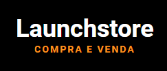
</h1>

<h4 align="center">
  🛒🛒  Launchstore 🚀
</h4>

<p align="center">
  <a href="https://www.linkedin.com/in/abnerwillys/">
    
  </a>

  

  <a href="https://rocketseat.com.br/">
    
  </a>

  <a href="https://www.javascript.com/">
    
  </a>
</p>

---

<p align="center">
  <a href="#-sobre">Sobre</a> •
  <a href="#-etapas-do-projeto">Etapas do projeto</a> • 
  <a href="#-tecnologias-utilizadas">Tecnologias</a> • 
  <a href="#-como-baixar/testar-o-projeto">Como baixar o projeto</a> • 
  <a href="#-licença">Licença</a> • 
  <a href="#-desenvolvedor">Desenvolvedor</a>
</p>

---
### 🔖 Sobre

O projeto **LaunchStore** é um e-commerce. Esse projeto desenvolvido durante o **Bootcamp LaunchBase** lecionado pela **Rocketseat**, com o intuito de colocar em prática todo o conhecimento adquirido. Conta com as grande maioria das funcionalidades de um e-commerce. Tais como: compra, venda, carrinho, cadastro informações e fotos de produtos, histórico de compras e vendas, segurança com registro, login, logout, recuperação de senha via email. Abaixo segue algumas telas:

<p align="center">
    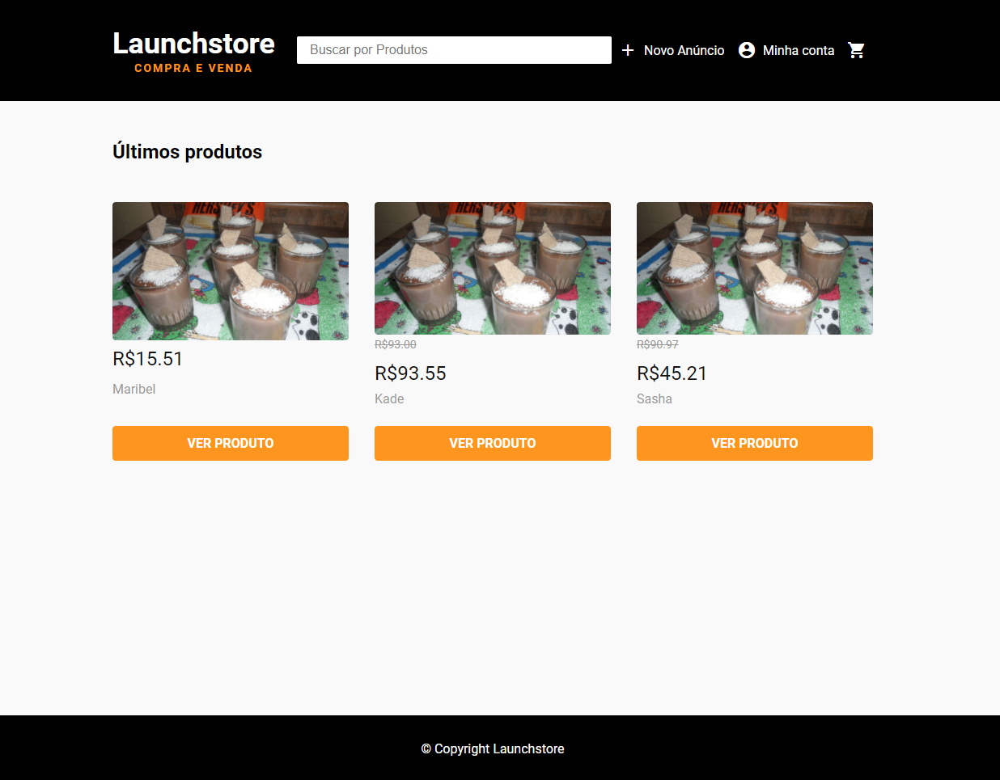
    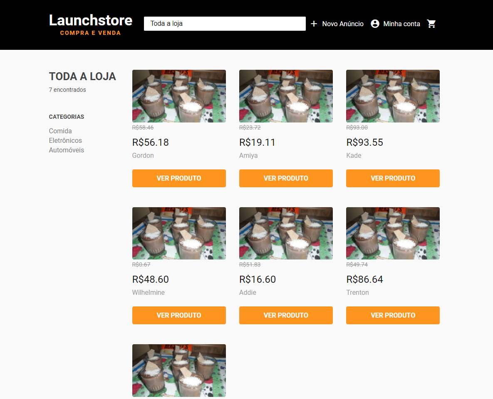
    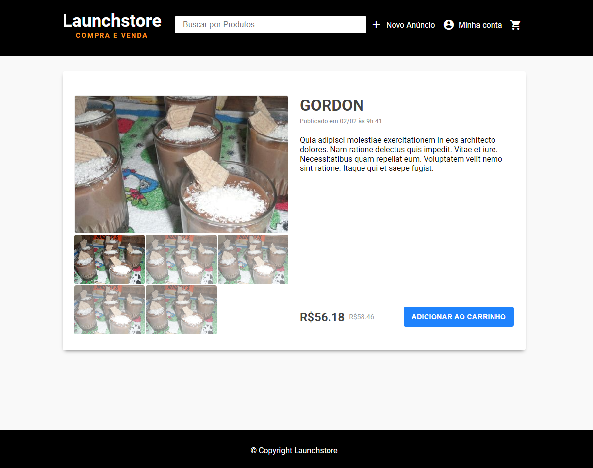
    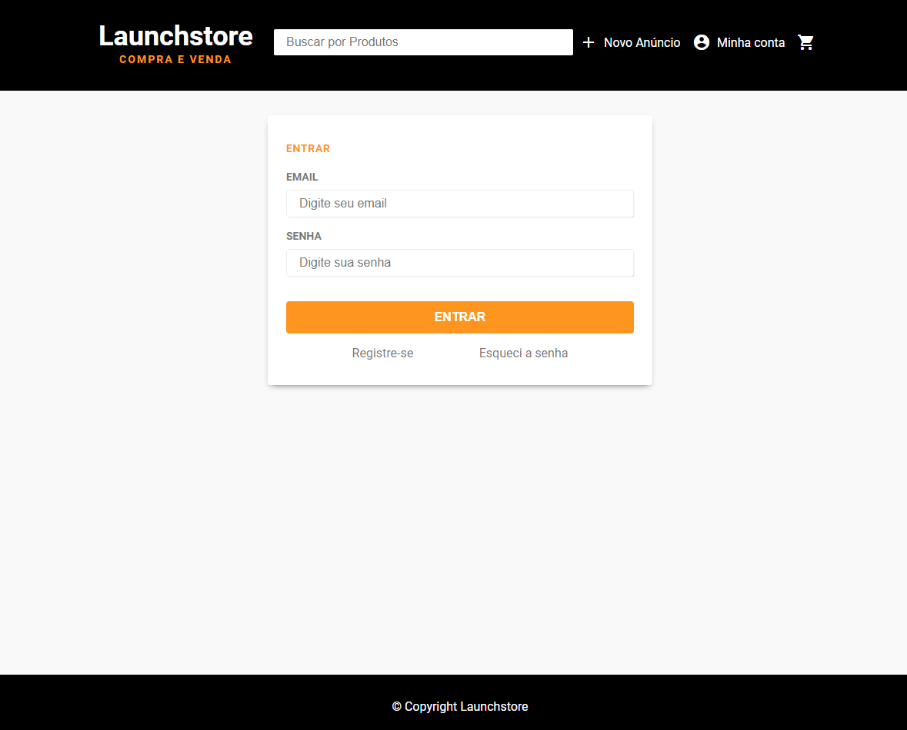
    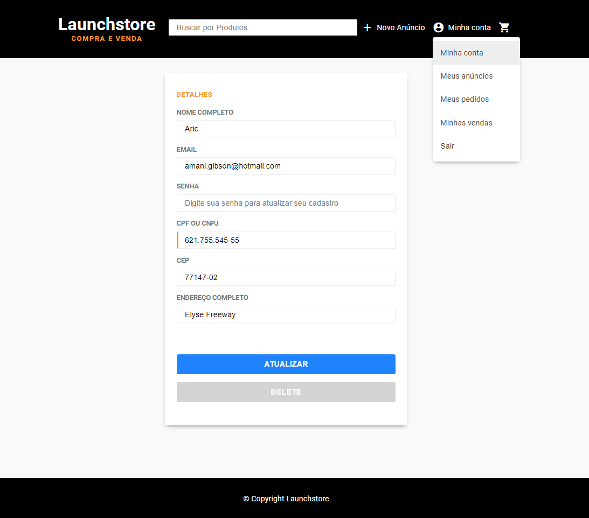
    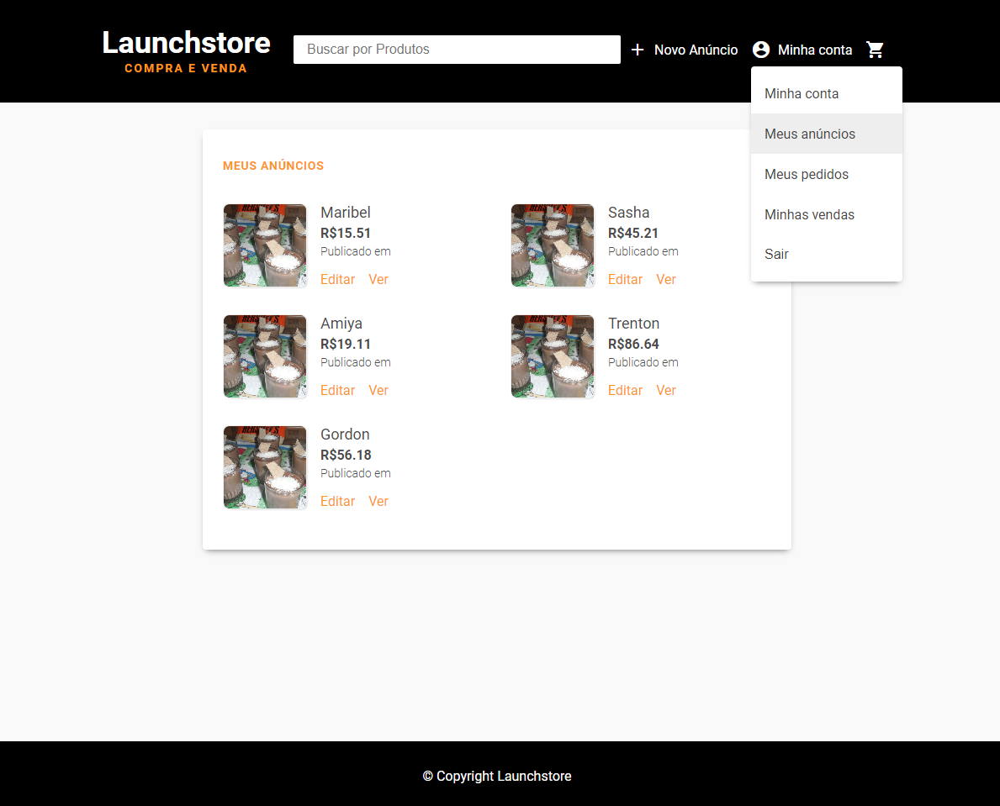
    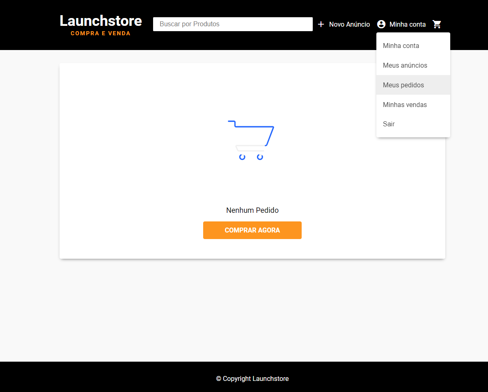
    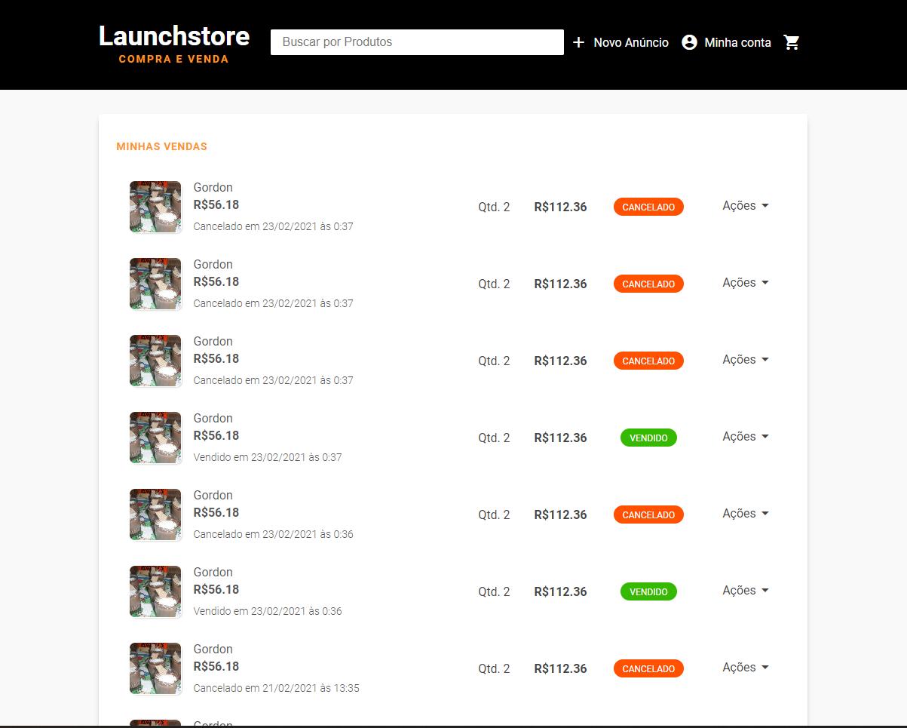
    
    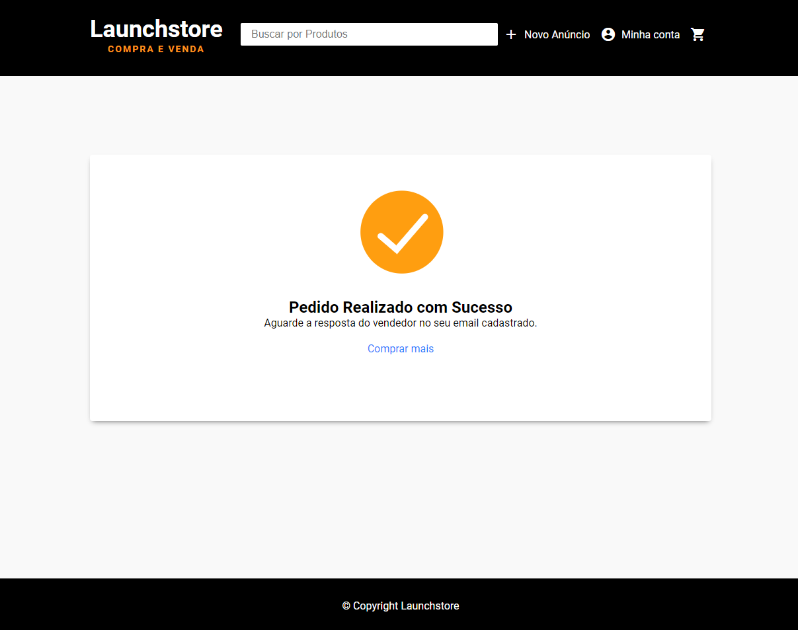
    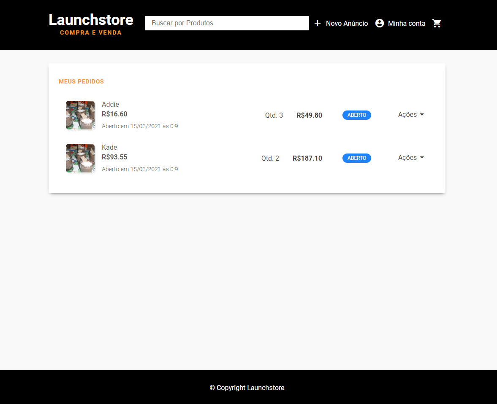
    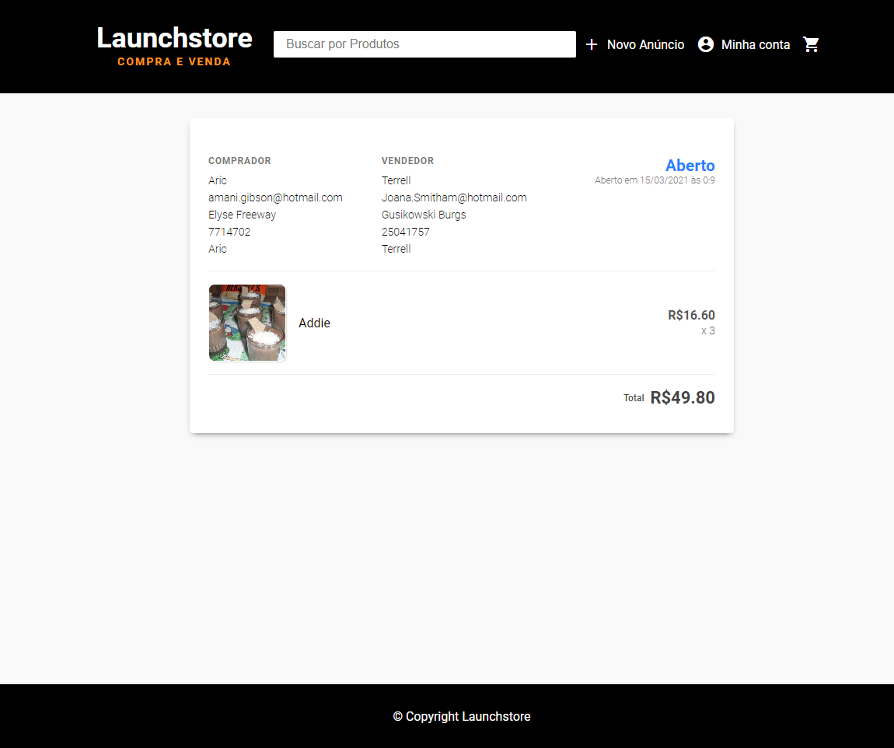
</p>

---
### 🛠 Tecnologias utilizadas

<p align="center">
As seguintes ferramentas foram usadas:

<p align="center">
    <a href="https://www.javascript.com/">
        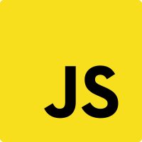
    </a>
    <a href="http://www.ecma-international.org/ecma-262/6.0/">
        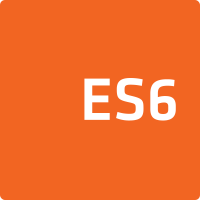
    </a>
    <a href="https://developer.mozilla.org/en-US/docs/Web/CSS">
        
    </a>
    <a href="https://developer.mozilla.org/en-US/docs/Web/HTML">
        
    </a>
    <a href="https://mozilla.github.io/nunjucks/">
        
    </a>
    <a href="https://nodejs.org/en/">
        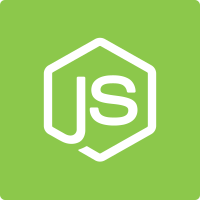
    </a>
    <a href="https://expressjs.com/">
        
    </a>
    <a href="https://git-scm.com/">
        
    </a>
    <a href="https://github.com/">
        
    </a>
    <a href="https://www.postgresql.org/">
        
    </a>
    <a href="https://www.electronjs.org/apps/postbird">
        
    </a>
    <a href="https://code.visualstudio.com/">
        
    </a>
</p>


---
### 📎 Como baixar/testar o projeto

##### 👉 Ferramentas necessárias:
- Editor:
    - [Vscode](https://code.visualstudio.com/) foi utilizado nesse projeto; 
- [Node.Js](https://nodejs.org/en/) - Instalado em sua máquina;
- [Yarn](https://yarnpkg.com/getting-started/install) - Gerenciador de pacotes de sua preferência (Yarn foi usado nesse projeto);
- [Git](https://git-scm.com/downloads) - Instalado em sua máquina;
- [PostBird](https://www.electronjs.org/apps/postbird) - Instalado em sua máquina;
- [PostgreSQL](https://www.postgresql.org/download/) - Instalado em sua máquina. Segue abaixo informações importantes:
    - [Configuração do Banco de Dados usado nesse projeto](https://github.com/abner-starkasty/launchstore/blob/master/src/config/db.js);
    - [Arquivo SQL para auxílio na criação do banco, tabelas e constraints](https://github.com/abner-starkasty/launchstore/blob/master/src/config/Launcstore.sql);


##### 👉 Após instalar as ferramentas:

```bash

#->No terminal:

# Clonar repositório
$ git clone https://github.com/abner-starkasty/Launchstore

# Entrar/abrir diretório do projeto no seu editor
$ cd Launchstore

# Criar banco de dados utilizando o arquivo Launcstore.sql

# Executar seeds.js para criar primeiro usuário
$ node src/config/seeds.js

# Instalar dependências
$ yarn

# Iniciar o server
$ yarn start

# Acesso de 2 formas:
  - manualmente pela porta: http://localhost:5000/
  - automaticamente (abre assim que iniciar o server) pelo browsersync: http://localhost:3000/

# Usuário criado através da seed, para poder logar no sistema:
  - email: pegar email atraves da tabela "users" no banco que foi criado;
  - senha: 12345

# Qualquer dúvida/críticas/sugestões sinta-se a vontade para entrar em contato em abwillys001@gmail.com
```


---
### 📜 Licença

Esse projeto está sob a licença MIT. Veja o arquivo [LICENSE](LICENSE) para mais detalhes.

---

### 👨‍💻 Desenvolvedor

<p align="center">
    <a href="https://blog.rocketseat.com.br/author/thiago/">
        
        <br/>
        <sub><b>Abner Willys  🚀</b></sub>
    </a>
</p>
</br>
<h6 align="center">
    Feito com 💜 por Abner Willys 🙌 Entre em contato 😊🤓
</h6>

<p align="center">
    <a href="https://www.linkedin.com/in/abnerwillys/">
        
    </a>
    <a href="https://twitter.com/AbnerStarkasty">
        
    </a>
    <a href="mailto:tgmarinho@gmail.com">
        
    </a>
    <a href="https://www.facebook.com/abnerwillys">
        
    </a>
    <a href="https://bit.ly/3eC6MX5">
        
    </a>
</p>